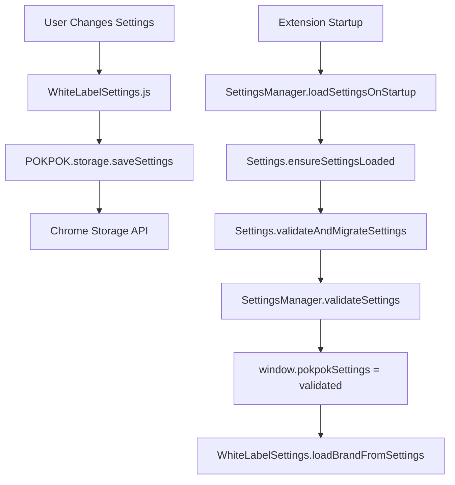

# POKPOK.AI - Tone Analysis Chrome Extension v2.53.0

A Chrome extension for advanced brand voice analysis using Nielsen's 4-dimensional framework and Jung's 12 Brand Archetypes. Features real-time tone analysis with integrated UI sliders, Gemini AI integration, comprehensive brand insights, and secure Google Drive backup functionality.

## 🌟 Current Features

### Dual Analysis Engine System
- **🤖 Gemini AI Integration**: Cloud-based comprehensive brand analysis
  - Advanced tone justification with detailed explanations
  - Dynamic brand archetype identification (all 12 Jungian archetypes)
  - Real-time API progress feedback with retry mechanism (2 attempts)
  - JSON output saving for debugging and analysis

- **⚡ Local Analysis Engine**: Fast offline analysis using compromise.js
  - Nielsen's 4-dimensional tone framework
  - Real-time slider updates with visual feedback
  - No API costs, complete privacy

### Nielsen's 4-Dimensional Tone Analysis
- **Formal vs. Casual**: Professional tone assessment (0-100% scale)
- **Serious vs. Funny**: Humor detection and measurement  
- **Respectful vs. Irreverent**: Respect level analysis
- **Matter-of-fact vs. Enthusiastic**: Energy and enthusiasm detection

### Dynamic Brand Archetype System
- **Jung's 12 Archetypes**: Complete archetype identification system
- **🚨 CRITICAL: Position-Based Mapping**: Dynamic primary/secondary/tertiary assignment
- **🔄 Dynamic Expandable Content**: No hardcoded mappings - all content generated at runtime
- **Universal Archetype Support**: Works with any archetype combination from Gemini
- **Click-to-Expand Justifications**: Fresh content loaded on each click

### Advanced UI Features
- **Button Progress Updates**: Real-time feedback during analysis ("✅ System prompt loaded", "🚀 Calling Gemini API...")
- **Dynamic Content Generation**: Justifications created on-demand via user interaction
- **Mode Switching**: Full page vs. selection analysis
- **Visual Feedback**: Animated logo, status indicators, and completion states
- **Console-to-Button Bridge**: Live console output displayed as button labels during analysis

### 🔐 Secure Google Drive Integration (v2.53.0)
- **Automatic JSON Backup**: Analysis results automatically uploaded to Google Drive
- **Service Account Authentication**: Enterprise-grade security using Google Cloud service accounts
- **Shared Drive Support**: Files uploaded to Google Workspace Shared Drives
- **JWT Token Generation**: Secure authentication using Chrome's Web Crypto API
- **Encrypted Credential Storage**: Service account keys encrypted before storage
- **Zero Manual Setup**: One-time credential paste, fully automated thereafter

## 🏗️ Technical Architecture (v2.53.0)

### Modern Chrome Extension Stack
- **✅ Manifest V3 Compliant**: Latest Chrome extension standards
- **🤖 Dual AI Engine**: Local (compromise.js) + Cloud (Gemini API)
- **🔐 Enterprise Security**: Service account authentication with JWT tokens
- **☁️ Cloud Integration**: Google Drive API v3 with Shared Drive support
- **🔧 Pure JavaScript**: No build process - runs vanilla JS + TypeScript-ready
- **📦 Modular Architecture**: 30+ specialized modules for maintainability

### Complete File Structure
```
pure-amazon-extension/
├── manifest.json                  # v2.53.0 - Extension configuration
├── analysis-simple.html           # Main UI with inline CSS
├── analysis.js                    # Legacy compatibility layer & delegation coordinator
├── background.js                  # Chrome extension service worker
├── content-script.js               # Page interaction & content extraction
├── content-styles.css             # Injected page styles
├── lib/compromise.min.js          # Local NLP library (340KB)
├── prompts/                       # Gemini AI system prompts
│   └── comprehensive-brand-analysis.md
└── js/                            # Modular JavaScript architecture:
    ├── 🏛️ CORE ARCHITECTURE
    ├── version.js                 # Centralized version management system
    ├── UIController.js            # Button states, mode switching, parsed content
    ├── AnalysisCoordinator.js     # Analysis orchestration and engine coordination
    ├── DataProcessor.js           # Gemini data processing and UI updates
    ├── ContentHandler.js          # Chrome tabs API and content script communication
    ├── SettingsManager.js         # Settings coordination and Chrome storage
    ├── ConsoleToButtonBridge.js   # Live console output as button labels
    ├── event-handlers.js          # DOM event binding system
    ├── 
    ├── 🔐 SECURITY & CLOUD INTEGRATION (v2.53.0)
    ├── SecureStorage.js           # AES-GCM credential encryption for Chrome storage
    ├── JWTGenerator.js            # JWT token generation using Web Crypto API
    ├── ServiceAccountSettings.js  # Secure service account credential input UI
    ├── GoogleDriveService.js      # Google Drive API v3 with Bearer token auth
    ├── 
    ├── 🤖 ANALYSIS ENGINES
    ├── GeminiAnalysisService.js   # Gemini API integration + retry logic + JSON backup
    ├── basic_analysis.js          # Local compromise.js analysis
    ├── 
    ├── ⚙️ SETTINGS SYSTEM
    ├── Settings.js                # Settings management system
    ├── ApiSettings.js             # Gemini API configuration
    ├── AnalysisSettings.js        # Analysis engine settings
    ├── SettingsTabs.js           # Settings UI tabs
    ├── WhiteLabelSettings.js     # Brand customization
    ├── 
    ├── 🎨 UI COMPONENTS
    ├── ToneAnalysisDisplay.js    # Tone sliders & display
    ├── BrandAnalysisCards.js     # Brand archetype cards
    ├── ContentAnalysisSwitch.js  # Analysis mode switching
    ├── Navigation.js             # Tab navigation system
    ├── StatusBar.js              # Connection status
    ├── AnimatedLogo.js           # Logo animation system
    ├── 
    ├── 🔧 UTILITIES
    ├── content-generators.js    # HTML template generators
    ├── RealContentAnalyzer.js   # Real content analysis
    ├── CompromiseDemo.js         # Demo functionality
    ├── chrome-api.js            # Chrome API wrapper
    ├── color-extractor.js       # Visual identity colors
    ├── visual-identity-updater.js # Visual identity updates
    └── ai-toggle.js             # Local/Cloud AI switching
```

#### **Module Loading Order** (analysis-simple.html)
```javascript
1. lib/compromise.min.js                 // NLP engine (compromise.js)
2. js/version.js                         // Centralized version management
3. js/basic_analysis.js                  // Core tone analysis functions
4. js/content-generators.js             // Static content templates  
5. js/chrome-api.js                      // Chrome extension API wrapper

6. // SECURITY MODULES (v2.53.0+)
7. js/SecureStorage.js                   // AES-GCM credential encryption
8. js/JWTGenerator.js                    // JWT token generation
9. js/ServiceAccountSettings.js          // Service account credential UI
10. js/GoogleDriveService.js              // Google Drive API integration

11. // SETTINGS SYSTEM
12. js/SettingsTabs.js                   // Settings UI tabs
13. js/ApiSettings.js                    // Gemini API configuration
14. js/WhiteLabelSettings.js             // Brand customization
15. js/AnalysisSettings.js               // Analysis engine settings
16. js/Settings.js                       // Configuration management

17. // UI COMPONENTS
18. js/AnimatedLogo.js                   // Logo symbol animation
19. js/StatusBar.js                      // Connection status UI
20. js/Navigation.js                     // Tab navigation
21. js/ContentAnalysisSwitch.js          // Mode switching logic
22. js/ToneAnalysisDisplay.js            // Slider display components
23. js/CompromiseDemo.js                 // Analysis demo controls
24. js/BrandAnalysisCards.js             // Static archetype UI
25. js/GeminiAnalysisService.js          // Gemini API integration + JSON backup

26. // CORE MODULAR ARCHITECTURE (v2.33.0+)
27. js/ConsoleToButtonBridge.js          // Live console output bridge
28. js/UIController.js                   // Button states & UI control
29. js/DataProcessor.js                  // Data processing & UI updates
30. js/ContentHandler.js                 // Chrome content script communication
31. js/SettingsManager.js                // Settings coordination
32. js/AnalysisCoordinator.js            // Analysis flow orchestration
33. js/event-handlers.js                 // DOM event listeners

34. // COLOR ANALYSIS (FULL_PAGE mode)
35. js/color-extractor.js                // Visual identity colors
36. js/visual-identity-updater.js        // Visual identity updates

37. // LEGACY COMPATIBILITY LAYER
38. analysis.js                          // Delegates to new modular architecture
```

## 🚨 CRITICAL FIXES & ARCHITECTURE DECISIONS (v2.34.0 - v2.35.0)

### ⚠️ **MOST CRITICAL LESSON: NO HARDCODED MAPPINGS**

**THE PROBLEM THAT KEPT REPEATING:**
- HTML had hardcoded archetype expandable sections with placeholder data
- JavaScript tried to match by archetype names instead of positions
- This caused displaying wrong content and prevented fresh data loading

**THE SOLUTION - POSITION-BASED MAPPING:**
```javascript
// ❌ WRONG - Name-based matching (NEVER DO THIS)
if (archetypeName === 'The Innocent') {
    data = geminiData.brand_archetypes.primary;  // ← BREAKS when Gemini returns different names
}

// ✅ CORRECT - Position-based mapping (ALWAYS DO THIS)
const position = Array.from(archetypeItems).indexOf(clickedItem);
if (position === 0) {
    data = geminiData.brand_archetypes.primary;    // ← ALWAYS WORKS regardless of names
    commentHeader = 'PRIMARY_ARCHETYPE_ANALYSIS';
}
```

### 🔄 **Dynamic Expandable Content System**

**How It Works Now (v2.35.0):**
1. **HTML has NO hardcoded expandable sections** - only archetype items
2. **First click**: Removes any existing expandable content (ensures fresh data)
3. **Second click**: Creates new expandable content with current analysis data
4. **Position-based headers**: Always shows correct comment headers regardless of data availability

```javascript
// Archetype toggle logic (analysis.js:349)
function toggleArchetype(item) {
    // STEP 1: Set comment header by POSITION (not data-dependent)
    if (position === 0) commentHeader = 'PRIMARY_ARCHETYPE_ANALYSIS';
    if (position === 1) commentHeader = 'SECONDARY_ARCHETYPE_ANALYSIS';  
    if (position === 2) commentHeader = 'TERTIARY_ARCHETYPE_ANALYSIS';
    
    // STEP 2: Try to get real Gemini data
    if (window.geminiAnalysisData && window.geminiAnalysisData.brand_archetypes) {
        archetypeData = window.geminiAnalysisData.brand_archetypes.primary; // position 0
        // ... use real data
    }
    
    // STEP 3: Always provide fallback content
    if (!content) {
        content = "Analysis data not available. Please run a new analysis...";
    }
}
```

### 📋 **Data Flow Architecture**

```mermaid
graph TD
    A[User Clicks Archetype] --> B[toggleArchetype()]
    B --> C{Existing Expandable?}
    C -->|Yes| D[Remove & Exit - Click Again]
    C -->|No| E[Determine Position 0,1,2]
    E --> F[Set Comment Header by Position]
    F --> G{geminiAnalysisData exists?}
    G -->|Yes| H[Use Real Analysis Data]
    G -->|No| I[Use Fallback Message]
    H --> J[Create Expandable Content]
    I --> J
    J --> K[Insert After Clicked Item]
```

## 🔄 Recent Major Updates

### **v2.53.0 - Secure Google Drive Integration + Centralized Version Management** 🔐

**The Enhancement:** Enterprise-grade Google Drive integration with service account authentication for automatic JSON backup

**Key Improvements:**
1. **🔐 Service Account Authentication**: Complete JWT-based authentication system
   - ✅ **RS256 JWT Generation**: Using Chrome's Web Crypto API for cryptographic signing
   - ✅ **Access Token Caching**: 55-minute token cache with 5-minute refresh buffer
   - ✅ **Bearer Token Auth**: Modern OAuth2 authentication for Google Drive API v3
   - ✅ **Shared Drive Support**: Full Google Workspace Shared Drive compatibility

2. **🛡️ Enterprise Security Infrastructure**:
   - ✅ **AES-GCM Encryption**: Service account credentials encrypted before Chrome storage
   - ✅ **Secure Credential UI**: Auto-validating JSON input with real-time feedback
   - ✅ **Zero Credential Exposure**: Keys never logged or transmitted in plain text
   - ✅ **Test Connection Feature**: Verify authentication before using

3. **☁️ Automatic JSON Backup System**:
   - ✅ **Zero-Config Uploads**: Analysis results automatically saved to Google Drive
   - ✅ **Non-Blocking Operation**: Drive uploads don't slow down extension performance
   - ✅ **Shared Drive Storage**: Files uploaded to `0AJAs3YBrbFCAUk9PVA` Shared Drive
   - ✅ **Comprehensive Logging**: Full audit trail of upload success/failure

4. **🔢 Centralized Version Management**:
   - ✅ **Single Source of Truth**: `js/version.js` contains authoritative version number
   - ✅ **Dynamic Version Display**: All UI elements use `window.POKPOK_VERSION`
   - ✅ **Prevents Version Drift**: Eliminates hardcoded version strings throughout codebase
   - ✅ **Console Version Logging**: Automatic version logging for debugging

**Security Architecture:**
```javascript
// Service Account Credential Flow (v2.53.0)
User Paste JSON → ServiceAccountSettings.js → Validate & Encrypt 
→ SecureStorage.js (AES-GCM) → Chrome Storage API

// Authentication Flow for Drive API
JWTGenerator.js → Generate RS256 JWT → Exchange for Access Token 
→ Cache Token (55min) → GoogleDriveService.js → Drive Upload

// File Upload Flow
Analysis Complete → GeminiAnalysisService.js → saveJsonOutput() 
→ GoogleDriveService.saveEverywhere() → Shared Drive Upload
```

**Developer Benefits:**
- 🔄 **Automatic Backup**: Never lose analysis results - all saved to cloud automatically
- 🛡️ **Enterprise Security**: Service account authentication prevents API key exposure
- ⚡ **Performance**: Non-blocking uploads don't impact extension responsiveness  
- 🎯 **Version Control**: Centralized version management eliminates update errors
- 📊 **Audit Trail**: Complete logging of all authentication and upload operations

### **v2.40.0 - Dynamic Prompt Loading + Gemini API 2025 Compliance** 🚀

**The Enhancement:** Improved Gemini API integration with real-time prompt updates and correct 2025 API structure

**Key Improvements:**
1. **Dynamic Prompt Loading**: System prompt now loads fresh from file on every "ANALYZE FULL PAGE" click
   - ✅ **Real-time updates**: Edit `/prompts/comprehensive-brand-analysis.md` → changes apply immediately  
   - ✅ **No extension reload needed**: Perfect for prompt iteration during development
   - ✅ **Timestamp logging**: Track exactly when prompt was loaded

2. **Gemini API 2025 Structure Compliance**: 
   - ✅ **Fixed API structure**: Proper `systemInstruction` + `contents` with role separation
   - ✅ **Increased timeout**: 30s → 60s for comprehensive analysis results
   - ✅ **Better compatibility**: Follows latest Google AI API specification

**API Structure Change:**
```javascript
// OLD v2.39.0 (Incorrect):
contents: [{ parts: [{ text: systemPrompt }, { text: userMessage }] }]

// NEW v2.40.0 (Correct):
systemInstruction: { parts: [{ text: freshSystemPrompt }] },
contents: [{ role: "user", parts: [{ text: userMessage }] }]
```

**Developer Benefits**: 
- 🔄 **Rapid prompt iteration** without extension reloads
- ⚡ **Better API performance** with correct structure
- 📊 **More comprehensive analysis** with longer timeout
- 🎯 **Cleaner separation** of system vs user messages

### **v2.39.0 - Brand Settings Persistence Fix (Complete)** 🎨

**The Problem:** User brand selection (PokPok ↔ DR) didn't persist across extension reloads

**Investigation Process:**
1. **Initial Analysis**: Suspected Settings.js migration issue → Enhanced migration logging
2. **Deep Dive**: Found settings were saving correctly (14 fields) but loading incorrectly (10 fields)  
3. **Root Cause Discovery**: SettingsManager.validateSettings() was filtering out fields not in defaults
4. **Critical Finding**: `getDefaultSettings()` was missing `whiteLabelBrand` field entirely

**Technical Solution:**
- **🔧 Fixed**: Added `whiteLabelBrand: 'pokpok'` to SettingsManager default settings structure
- **✅ Enhanced**: Settings validation now preserves additional fields not in defaults 
- **📋 Added**: Comprehensive debug logging throughout settings processing pipeline
- **🚀 Result**: All 16 settings fields now preserved (vs. previous 10)

**Code Changes Made:**
```javascript
// SettingsManager.js - getDefaultSettings()
+ whiteLabelBrand: 'pokpok'  // Added missing field

// SettingsManager.js - validateSettings() 
+ Object.keys(settings).forEach(key => {
+     if (!defaults.hasOwnProperty(key)) {
+         validated[key] = settings[key]; // Preserve additional fields
+     }
+ });
```

**Verification:** Brand selection now persists perfectly across extension reloads with full console logging for debugging

### **v2.35.0 - Comment Header Fix** 🏷️
- **🔧 Fixed**: Missing comment headers when no analysis data available
- **✅ Added**: Position-based header assignment regardless of data availability
- **📋 Enhanced**: Always shows `// PRIMARY_ARCHETYPE_ANALYSIS` instead of empty `// `

### **v2.34.0 - Archetype Mapping Complete Fix** ✨
- **🚨 CRITICAL**: Removed ALL hardcoded expandable sections from HTML
- **🔧 Fixed**: toggleArchetype() now always processes fresh data (no early exit)
- **✅ Added**: Comprehensive logging for debugging archetype data flow
- **🔄 Enhanced**: Position-based mapping with fallback content system

### **v2.33.0 - Console-to-Button Bridge & Modular Architecture** 🏗️
- **🚀 Added**: Live console output displayed as animated button labels during analysis
- **📦 Added**: Complete modular architecture (5 core modules ≤300 lines each)
- **🔧 Fixed**: Button state management for SELECTION mode analysis
- **✅ Enhanced**: All console messages intercepted and displayed during analysis process

### **v2.32.0 - Button State Management Fix** ⚡
- **🔧 Fixed**: SELECTION mode button not returning to default state after analysis
- **✅ Added**: endAnalysisMode() calls to restore original console functions
- **🔄 Enhanced**: Proper cleanup in ConsoleToButtonBridge system

## 🧠 **LESSONS LEARNED - FOR FUTURE DEVELOPMENT**

### 1. **NEVER Use Name-Based Matching**
```javascript
// ❌ THIS WILL ALWAYS BREAK
if (item.textContent === 'The Innocent') { /* ... */ }

// ✅ THIS ALWAYS WORKS  
const position = Array.from(items).indexOf(item);
if (position === 0) { /* primary */ }
```

### 2. **NEVER Hardcode Expandable Content in HTML**
```html
<!-- ❌ NEVER DO THIS - Prevents dynamic data loading -->
<div class="archetype-expandable">Hardcoded content...</div>

<!-- ✅ ALWAYS DO THIS - Let JavaScript create content dynamically -->
<div class="archetype-item">Just the archetype item</div>
```

### 3. **ALWAYS Set Headers by Position**
```javascript
// ✅ Set headers BEFORE checking data availability
let commentHeader = position === 0 ? 'PRIMARY_ARCHETYPE_ANALYSIS' : 
                   position === 1 ? 'SECONDARY_ARCHETYPE_ANALYSIS' : 
                   'TERTIARY_ARCHETYPE_ANALYSIS';

// Then try to get data
if (geminiAnalysisData) { /* use real data */ }
else { /* use fallback with proper header */ }
```

### 4. **ALWAYS Use Try/Catch with Button State Reset**
```javascript
try {
    setButtonAnalyzing();
    const result = await analysis();
    setButtonAnalyzed();
} catch (error) {
    resetButtonState(); // ← CRITICAL: Always reset on error
} finally {
    if (window.ConsoleToButtonBridge) {
        window.ConsoleToButtonBridge.endAnalysisMode(); // ← CRITICAL: Always end bridge
    }
}
```

## 🔮 Future Development Guidelines

### **When Adding New Features:**
1. **Check existing modular architecture** - use UIController, DataProcessor, etc.
2. **Never hardcode mappings** - always use position/index-based logic
3. **Test before and after analysis** - ensure proper fallback behavior
4. **Update version numbers** - manifest.json AND HTML status display
5. **Add comprehensive logging** - help future debugging

### **When Fixing Bugs:**
1. **Read the entire function flow** - understand why it was written that way
2. **Look for hardcoded assumptions** - usually the root cause
3. **Test edge cases** - what happens when data is null/undefined?
4. **Follow the data flow** - where is data stored, accessed, modified?

## 📊 Code Metrics (v2.35.0)

| Module | Lines | Purpose | Maintainability |
|--------|-------|---------|----------------|
| UIController.js | <300 | Button states, UI control | ✅ Focused |
| AnalysisCoordinator.js | <300 | Analysis orchestration | ✅ Focused |
| DataProcessor.js | <300 | Data processing & UI updates | ✅ Focused |
| ContentHandler.js | <300 | Chrome API communication | ✅ Focused |
| SettingsManager.js | <300 | Settings coordination | ✅ Focused |
| analysis.js | 575 | Legacy compatibility layer | ✅ Delegation only |
| **Total Architecture** | **~1,800** | **Modular system** | ✅ **Maintainable** |

## 🏗️ Settings Architecture (v2.39.0)

### **Settings Data Flow Pipeline**


### **Critical Settings Fields**
```javascript
// Complete settings structure (16 fields in v2.39.0)
{
    version: "2.28.0",           // Settings schema version
    aiEngine: "local",           // Analysis engine preference  
    model: "gemini-2.5-flash",   // AI model selection
    apiKey: "",                  // Encrypted Gemini API key
    supabaseDb: "",             // Database connection
    autoAnalyze: false,         // Auto-analysis setting
    deepAnalysis: false,        // Deep analysis mode
    saveHistory: false,         // History persistence
    whiteLabelName: "POKPOK.AI", // Display name
    whiteLabelColors: {...},    // Brand color scheme
    whiteLabelBrand: "pokpok",  // ✅ CRITICAL: Brand selection
    lastSettingsTab: "api",     // UI state
    extensionVersion: "2.39.0", // Extension version
    savedAt: "timestamp",       // Save timestamp
    migrated: true,             // Migration status
    previousExtensionVersion: "2.38.0" // Previous version
}
```

### **Settings Validation Logic (v2.39.0)**
```javascript
// SettingsManager.js - validateSettings()
function validateSettings(settings) {
    // 1. Load defaults (11 core fields)
    const defaults = getDefaultSettings();
    const validated = { ...defaults };
    
    // 2. Validate known fields with type checking
    Object.keys(defaults).forEach(key => {
        if (settings.hasOwnProperty(key) && 
            typeof settings[key] === typeof defaults[key]) {
            validated[key] = settings[key];
        }
    });
    
    // 3. ✅ CRITICAL FIX: Preserve additional fields
    Object.keys(settings).forEach(key => {
        if (!defaults.hasOwnProperty(key)) {
            console.log(`🔧 Preserving additional setting: ${key}=${settings[key]}`);
            validated[key] = settings[key]; // Preserves whiteLabelBrand!
        }
    });
    
    return validated; // Returns complete 16-field object
}
```

## 🛡️ Security & Permissions

### **Manifest V3 Compliance**
- `sidePanel`: Analysis interface display
- `activeTab`: Current webpage content access  
- `storage`: Local settings persistence
- `scripting`: Content script injection
- `host_permissions`: All websites + Google APIs (`*://*/*`, `https://www.googleapis.com/*`)

### **Security Architecture (v2.53.0)**

#### **🔐 Credential Encryption System - SecureStorage.js**
```javascript
// AES-GCM encryption for service account credentials
class SecureStorage {
    // 1. Generate 256-bit encryption key using Web Crypto API
    generateEncryptionKey() → crypto.subtle.generateKey('AES-GCM', 256-bit)
    
    // 2. Encrypt service account JSON using AES-GCM
    encrypt(serviceAccountData) → {
        encryptedData: ArrayBuffer,
        iv: Uint8Array,        // 96-bit initialization vector
        key: CryptoKey         // Non-extractable encryption key
    }
    
    // 3. Store in Chrome storage with key conversion for persistence
    storeServiceAccountKey(data) → chrome.storage.local.set({
        serviceAccountKey: base64(encryptedData),
        encryptionIV: base64(iv),
        keyData: exportedKeyData  // Only for storage, never exposed
    })
}

// CRITICAL SECURITY NOTES:
// - Keys never stored in plain text anywhere in the extension
// - IV (Initialization Vector) is unique per encryption operation
// - Chrome storage encrypts data at rest (OS-level encryption)
// - AES-GCM provides both confidentiality and authenticity
```

#### **🎫 JWT Authentication System - JWTGenerator.js**
```javascript
// RS256 JWT generation for Google service account authentication
class JWTGenerator {
    // 1. Import service account private key (PKCS#8 format)
    importPrivateKey(pemKey) → crypto.subtle.importKey('RSASSA-PKCS1-v1_5', SHA-256)
    
    // 2. Create JWT claims for Google Drive API
    generateJWT(serviceAccount) → {
        header: { alg: 'RS256', typ: 'JWT' },
        payload: {
            iss: serviceAccount.client_email,    // Issuer
            sub: serviceAccount.client_email,    // Subject  
            scope: 'https://www.googleapis.com/auth/drive',
            aud: 'https://oauth2.googleapis.com/token',
            iat: currentTimestamp,               // Issued at
            exp: currentTimestamp + 3600         // Expires in 1 hour
        }
    }
    
    // 3. Sign JWT using RS256 algorithm
    signJWT(unsignedToken) → crypto.subtle.sign('RSASSA-PKCS1-v1_5', privateKey, token)
    
    // 4. Exchange JWT for OAuth2 access token
    getAccessToken(jwt) → fetch('https://oauth2.googleapis.com/token', {
        grant_type: 'urn:ietf:params:oauth:grant-type:jwt-bearer',
        assertion: signedJWT
    }) → { access_token, expires_in, token_type: 'Bearer' }
    
    // 5. Cache tokens with 55-minute lifetime (5-minute buffer before expiry)
    getCachedAccessToken() → cachedToken || generateFreshToken()
}

// CRITICAL SECURITY NOTES:
// - Private keys never transmitted over network
// - JWT tokens are single-use and expire in 1 hour
// - Access tokens cached for 55 minutes to prevent excessive API calls
// - All cryptographic operations use Chrome's Web Crypto API (hardware-accelerated)
```

#### **☁️ Google Drive Integration - GoogleDriveService.js**
```javascript
// Secure Google Drive API v3 integration with Shared Drive support
class GoogleDriveService {
    // 1. Initialize with service account authentication check
    initialize() → SecureStorage.hasServiceAccountKey()
    
    // 2. Upload JSON files to Google Workspace Shared Drive
    saveToGoogleDrive(jsonData, filename) → {
        // Get fresh access token
        tokenData = JWTGenerator.getCachedAccessToken(serviceAccount)
        
        // Create file metadata for Shared Drive
        metadata = {
            name: filename,
            parents: ['0AJAs3YBrbFCAUk9PVA'],  // Shared Drive ID
            mimeType: 'application/json',
            driveId: '0AJAs3YBrbFCAUk9PVA'     // Explicit Shared Drive targeting
        }
        
        // Upload with Bearer token authentication
        fetch('https://www.googleapis.com/upload/drive/v3/files?uploadType=multipart&supportsAllDrives=true', {
            method: 'POST',
            headers: { 'Authorization': `Bearer ${access_token}` },
            body: multipartFormData(metadata, jsonData)
        })
    }
    
    // 3. Non-blocking backup system
    saveEverywhere(data, filename) → {
        // Trigger Drive upload asynchronously (doesn't block extension)
        saveToGoogleDrive(data, filename).then(success → log)
        return immediately  // Extension continues without waiting
    }
}

// CRITICAL SECURITY NOTES:
// - Uses Bearer tokens (OAuth2 standard) instead of API keys
// - Shared Drive provides centralized storage with workspace permissions
// - Non-blocking uploads prevent extension performance impact
// - Automatic token refresh on 401/403 errors
// - Files uploaded with proper MIME types for Drive recognition
```

#### **⚙️ Service Account UI - ServiceAccountSettings.js**
```javascript
// Secure credential input interface with validation and testing
class ServiceAccountSettings {
    // 1. Validate service account JSON structure
    validateServiceAccountJSON(jsonString) → {
        requiredFields: ['type', 'project_id', 'private_key', 'client_email'],
        validation: {
            type: 'service_account',
            private_key: contains('BEGIN PRIVATE KEY'),
            client_email: ends_with('.iam.gserviceaccount.com')
        }
    }
    
    // 2. Auto-save with security measures
    saveServiceAccount() → {
        validate(jsonInput) → encrypt(validData) → store(encryptedData)
        clearTextarea()  // Immediately remove plain text from UI
        updatePlaceholder('Service account stored securely ✅')
    }
    
    // 3. Connection testing
    testDriveConnection() → {
        generateToken(storedCredentials)
        testAPI('https://www.googleapis.com/drive/v3/about')
        displayResult(success/failure)
    }
    
    // 4. Secure credential clearing
    clearServiceAccount() → {
        confirmDialog('⚠️ Are you sure?')
        SecureStorage.clearServiceAccountKey()
        JWTGenerator.clearTokenCache()
        resetUI()
    }
}

// CRITICAL SECURITY NOTES:
// - JSON validation prevents malformed credential injection
// - Textarea cleared immediately after saving (no plain text persistence)
// - Test connection validates credentials without storing analysis data
// - Clear function removes both encrypted credentials and cached tokens
// - Auto-save on textarea blur prevents accidental credential loss
```

### **Privacy Features**  
- **Encrypted credential storage**: All sensitive data encrypted with AES-GCM before storage
- **No credential exposure**: Private keys never logged, transmitted, or stored in plain text
- **Local processing**: All tone analysis local unless Gemini API explicitly enabled
- **Zero telemetry**: No data collection or usage tracking
- **Chrome storage isolation**: Extension data isolated from other extensions and websites
- **Service account isolation**: Google Drive access limited to designated Shared Drive only

## 🤖 Gemini API Integration & Recent Metadata Fixes (v2.53.0)

### **Critical Metadata Bug Fix - GeminiAnalysisService.js**

**The Problem:** JSON output showed hardcoded `"thinkingMode": true` even when user disabled all Gemini features
```javascript
// ❌ BROKEN CODE (lines 742-747 before fix):
features: {
    thinkingMode: true,        // ← HARDCODED - ignored user settings
    urlContext: true,          // ← HARDCODED - ignored user settings  
    googleSearch: true,        // ← HARDCODED - ignored user settings
    highTemperature: false,
    thinkingBudget: 2048
}
```

**The Solution:** Dynamic metadata generation based on actual user settings
```javascript
// ✅ FIXED CODE (v2.53.0):
// Updated function signature to accept geminiFeatures parameter
async function saveJsonOutput(requestData, responseData, analysisData, url, geminiFeatures = {}) {
    
    // Generate metadata from ACTUAL user settings, not hardcoded values
    const metadata = {
        timestamp: new Date().toISOString(),
        url: url,
        analysisEngine: 'gemini',
        features: {
            thinkingMode: geminiFeatures.thinkingMode || false,      // ← Uses real settings
            urlContext: geminiFeatures.urlContext || false,         // ← Uses real settings
            googleSearch: geminiFeatures.googleSearch || false,     // ← Uses real settings
            highTemperature: geminiFeatures.highTemperature || false,
            thinkingBudget: geminiFeatures.thinkingMode ? 2048 : 0  // ← Conditional based on actual mode
        },
        version: window.POKPOK_VERSION || "2.53.0"
    };
    
    // 🔄 NEW: Automatic Google Drive backup integration
    const filename = `pokpok-analysis-${new Date().toISOString().slice(0,16).replace(/:/g,'-')}.json`;
    
    // Save locally (existing functionality)
    downloadJsonFile(fullData, filename);
    
    // 🆕 NEW: Automatic cloud backup (non-blocking)
    if (window.GoogleDriveService && window.GoogleDriveService.initialized) {
        window.GoogleDriveService.saveEverywhere(fullData, filename);
        console.log('☁️ JSON automatically backed up to Google Drive');
    }
}

// ✅ USAGE: All callers now pass actual geminiFeatures object
analyzeFullPageWithGemini() {
    const geminiFeatures = {
        thinkingMode: document.getElementById('geminiThinkingMode')?.checked || false,
        urlContext: document.getElementById('geminiUrlContext')?.checked || false,
        googleSearch: document.getElementById('geminiWebSearch')?.checked || false,
        highTemperature: document.getElementById('geminiHighTemp')?.checked || false
    };
    
    // Pass real user settings to prevent hardcoded metadata
    await window.GeminiAnalysisService.saveJsonOutput(
        requestData, responseData, analysisData, currentUrl, geminiFeatures
    );
}
```

### **Gemini API Call Architecture & Logic Flow**

#### **🎯 Analysis Initialization Flow**
```javascript
// 1. User clicks "ANALYZE FULL PAGE" button
analyzeFullPageWithGemini() {
    // Check prerequisites
    if (!geminiApiKey) return showError('API key required');
    if (!window.GeminiAnalysisService) return showError('Service not available');
    
    // Collect user settings from UI checkboxes
    const geminiFeatures = {
        thinkingMode: getElementById('geminiThinkingMode')?.checked || false,
        urlContext: getElementById('geminiUrlContext')?.checked || false,  
        googleSearch: getElementById('geminiWebSearch')?.checked || false,
        highTemperature: getElementById('geminiHighTemp')?.checked || false
    };
    
    // Start analysis with real-time UI feedback
    startAnalysisMode();  // Activates ConsoleToButtonBridge
    window.GeminiAnalysisService.analyzeFullPageWithGemini(currentUrl, geminiFeatures);
}
```

#### **🔄 Dynamic Prompt Loading System (v2.40.0+)**
```javascript
// GeminiAnalysisService.js - Fresh prompt loading on every analysis
async function analyzeFullPageWithGemini(url, geminiFeatures) {
    console.log('🎯 Starting Gemini page analysis with fresh prompt...');
    
    // 1. Load fresh system prompt from file (no caching)
    console.log('📄 Loading fresh system prompt from file...');
    const systemPrompt = await loadSystemPrompt();
    console.log('✅ Fresh system prompt loaded successfully', {
        length: systemPrompt.length,
        timestamp: new Date().toISOString()
    });
    
    // 2. Extract webpage content
    const webpageContent = await extractWebpageContent(url);
    
    // 3. Create user message with conditional context
    let userMessage = `Please analyze this webpage content:\n\n${webpageContent}`;
    
    if (geminiFeatures.urlContext) {
        userMessage = `URL: ${url}\n\n${userMessage}`;
    }
    
    if (geminiFeatures.googleSearch) {
        userMessage += `\n\nPlease also use web search to get additional context about this brand/company.`;
    }
    
    // 4. Configure API request with 2025-compliant structure
    const requestBody = {
        // ✅ CORRECT 2025 API Structure
        systemInstruction: {
            parts: [{ text: systemPrompt }]  // Fresh prompt, not cached
        },
        contents: [{
            role: "user", 
            parts: [{ text: userMessage }]
        }],
        generationConfig: {
            temperature: geminiFeatures.highTemperature ? 0.9 : 0.7,
            maxOutputTokens: 8192,
            topP: 0.8,
            topK: 40
        }
    };
    
    // Add thinking mode if enabled
    if (geminiFeatures.thinkingMode) {
        requestBody.generationConfig.thinkingConfig = {
            maxThinkingTokens: 2048
        };
    }
    
    console.log('🤖 Making Gemini API call with 2025 structure...');
    
    // 5. Make API call with extended timeout (60 seconds)
    const response = await fetch(`https://generativelanguage.googleapis.com/v1beta/models/gemini-2.5-flash:generateContent?key=${apiKey}`, {
        method: 'POST',
        headers: { 'Content-Type': 'application/json' },
        body: JSON.stringify(requestBody),
        timeout: 60000  // 60 second timeout for comprehensive analysis
    });
    
    // 6. Process response and save with metadata
    if (response.ok) {
        const data = await response.json();
        console.log('📥 API response received');
        
        // Parse and store analysis data globally
        window.geminiAnalysisData = parseGeminiResponse(data);
        
        // Save JSON with actual user settings (not hardcoded)
        await saveJsonOutput(requestBody, data, window.geminiAnalysisData, url, geminiFeatures);
        
        // Update UI with analysis results
        updateAnalysisDisplay(window.geminiAnalysisData);
        
        console.log('✅ Full page analysis completed successfully');
    }
}
```

#### **📊 Real-Time Progress Feedback System**
```javascript
// ConsoleToButtonBridge.js - Live console output as button text
class ConsoleToButtonBridge {
    startAnalysisMode() {
        // Intercept console.log and display as button text
        this.originalLog = console.log;
        console.log = (message) => {
            this.originalLog(message);  // Still log to console
            this.updateButtonText(message);  // Also show on button
        };
        
        // Start button animation
        this.button.classList.add('analyzing');
        this.button.innerHTML = '🤖 Starting analysis...';
    }
    
    updateButtonText(message) {
        // Convert console messages to user-friendly button text
        const messageMap = {
            '🎯 Starting Gemini page analysis': '🎯 Initializing...',
            '📄 Loading fresh system prompt': '📄 Loading prompt...',
            '✅ Fresh system prompt loaded': '✅ Prompt ready',
            '🤖 Making Gemini API call': '🤖 Calling API...',
            '📥 API response received': '📥 Processing...',
            '✅ Full page analysis completed': '✅ Analysis Complete!'
        };
        
        const buttonText = messageMap[message] || message;
        this.button.innerHTML = buttonText;
    }
    
    endAnalysisMode() {
        // Restore original console.log
        console.log = this.originalLog;
        
        // Reset button state
        this.button.classList.remove('analyzing');
        this.button.innerHTML = 'ANALYZE FULL PAGE';
    }
}
```

#### **🗂️ JSON Output Structure & Metadata**
```javascript
// Complete JSON structure saved to Downloads + Google Drive
{
    // User's request data
    request: {
        systemInstruction: { parts: [{ text: "Fresh system prompt..." }] },
        contents: [{ role: "user", parts: [{ text: "User message with webpage content" }] }],
        generationConfig: {
            temperature: 0.7,  // Based on user's high temp setting
            maxOutputTokens: 8192,
            thinkingConfig: {  // Only if thinking mode enabled
                maxThinkingTokens: 2048
            }
        }
    },
    
    // Gemini's raw response
    response: {
        candidates: [{
            content: { parts: [{ text: "Analysis results..." }] },
            finishReason: "STOP",
            avgLogprobs: -0.0123
        }],
        usageMetadata: {
            promptTokenCount: 1234,
            candidatesTokenCount: 5678,
            totalTokenCount: 6912
        }
    },
    
    // Parsed analysis data (used by extension)
    analysis: {
        brand_archetypes: {
            primary: { name: "The Explorer", percentage: 78, ... },
            secondary: { name: "The Creator", percentage: 65, ... },
            tertiary: { name: "The Innocent", percentage: 52, ... }
        },
        tone_analysis: {
            formal_casual: { score: 68, justification: "..." },
            serious_funny: { score: 45, justification: "..." },
            respectful_irreverent: { score: 82, justification: "..." },
            matter_of_fact_enthusiastic: { score: 71, justification: "..." }
        }
    },
    
    // ✅ ACCURATE metadata based on actual user settings
    metadata: {
        timestamp: "2025-01-19T14:30:45.123Z",
        url: "https://example.com/analyzed-page",
        analysisEngine: "gemini",
        features: {
            thinkingMode: true,        // ← Actual checkbox state
            urlContext: false,         // ← Actual checkbox state
            googleSearch: true,        // ← Actual checkbox state  
            highTemperature: false,    // ← Actual checkbox state
            thinkingBudget: 2048       // ← Conditional: 2048 if thinking enabled, 0 if disabled
        },
        version: "2.53.0",
        googleDriveBackup: true        // ← Indicates if uploaded to Drive
    }
}
```

### **🚨 Critical Lessons Learned - Gemini Integration**

#### **1. Never Hardcode User Settings in Metadata**
```javascript
// ❌ WRONG - Breaks user trust and debugging
features: { thinkingMode: true }  // Always shows true regardless of user choice

// ✅ CORRECT - Reflects actual user choices  
features: { thinkingMode: geminiFeatures.thinkingMode || false }
```

#### **2. Always Pass Settings Object Through Call Chain**
```javascript
// ❌ WRONG - Settings lost between functions
analyzeFullPageWithGemini(url);  // No settings passed
saveJsonOutput(req, res, data, url);  // No way to know user settings

// ✅ CORRECT - Settings preserved throughout analysis
analyzeFullPageWithGemini(url, geminiFeatures);
saveJsonOutput(req, res, data, url, geminiFeatures);  // Settings available for metadata
```

#### **3. Fresh Prompt Loading for Development Agility**
```javascript
// ✅ BENEFIT: Edit prompt file → immediate effect (no extension reload)
const systemPrompt = await fetch('prompts/comprehensive-brand-analysis.md')
    .then(r => r.text());
console.log('✅ Fresh system prompt loaded', { timestamp: new Date().toISOString() });

// This enables rapid prompt iteration during development
```

#### **4. 2025 API Structure Compliance**
```javascript
// ❌ OLD STRUCTURE (doesn't work reliably):
contents: [{ parts: [{ text: systemPrompt }, { text: userMessage }] }]

// ✅ NEW STRUCTURE (Google's 2025 standard):  
systemInstruction: { parts: [{ text: systemPrompt }] },
contents: [{ role: "user", parts: [{ text: userMessage }] }]
```

## 🔢 Centralized Version Management System (v2.53.0)

### **The Version Chaos Problem**
**Before v2.53.0:** Version numbers were hardcoded in multiple places, leading to:
- Forgetting to update manifest.json after code changes
- Hardcoded version strings scattered throughout the codebase  
- Inconsistent version displays between UI and metadata
- Manual synchronization required across 3+ files for every update

### **The Solution: js/version.js**
**Single Source of Truth:** All version references now derive from one centralized file
```javascript
// js/version.js - The ONLY place version is defined
window.POKPOK_VERSION = "2.53.0";

// Automatic console logging for debugging
console.log(`🔧 POKPOK.AI Extension Version: ${window.POKPOK_VERSION}`);
```

### **Version System Architecture**
```mermaid  
graph TD
    A[js/version.js] --> B[window.POKPOK_VERSION = "2.53.0"]
    B --> C[manifest.json - Manual Update Required]
    B --> D[HTML Status Display - Dynamic]
    B --> E[JSON Metadata - Dynamic]
    B --> F[Console Logging - Dynamic]
    B --> G[Error Reports - Dynamic]
    
    C --> H[Chrome Extension API Requirements]
    D --> I[User Interface Display]
    E --> J[Analysis Output Files]
    F --> K[Development Debugging]
    G --> L[Bug Report Information]
```

### **Implementation Details**

#### **🏗️ File Structure**
```javascript
// 1. js/version.js (SINGLE SOURCE OF TRUTH)
window.POKPOK_VERSION = "2.53.0";  // ← ONLY place version is defined
console.log(`🔧 POKPOK.AI Extension Version: ${window.POKPOK_VERSION}`);

// 2. manifest.json (MANUAL UPDATE STILL REQUIRED)  
{
    "name": "POKPOK.AI - Tone Analysis v2.53.0",   // ← Must manually sync
    "version": "2.53.0",                           // ← Must manually sync
    // ... Chrome requires this for extension management
}

// 3. analysis-simple.html (DYNAMIC VERSION DISPLAY)
<script src="js/version.js"></script>  // Load version first
<!-- Version display automatically updates -->
<div class="pokpok-version">POKPOK.AI v<span id="versionDisplay">Loading...</span></div>

<script>
// Populate version dynamically
document.getElementById('versionDisplay').textContent = window.POKPOK_VERSION;
</script>

// 4. GeminiAnalysisService.js (DYNAMIC METADATA)
const metadata = {
    version: window.POKPOK_VERSION || "2.53.0",  // ← Dynamic version in JSON
    timestamp: new Date().toISOString(),
    // ... rest of metadata
};
```

#### **🔄 Loading Order Compliance**
```html
<!-- analysis-simple.html - Version must load FIRST -->
<script src="js/version.js"></script>                    <!-- ← Load version FIRST -->
<script src="lib/compromise.min.js"></script>           <!-- Then other dependencies -->
<script src="js/basic_analysis.js"></script>
<!-- ... all other scripts have access to window.POKPOK_VERSION -->
```

#### **📊 Dynamic Version Integration Examples**
```javascript
// ✅ JSON Metadata (GeminiAnalysisService.js)
const analysisMetadata = {
    version: window.POKPOK_VERSION,           // Dynamic version
    extensionName: "POKPOK.AI",
    timestamp: new Date().toISOString(),
    analysisEngine: "gemini"
};

// ✅ Error Reporting (Multiple files) 
console.error(`❌ Error in POKPOK.AI v${window.POKPOK_VERSION}:`, error);
console.log(`🎯 Analysis started - Extension v${window.POKPOK_VERSION}`);

// ✅ UI Status Display (analysis-simple.html)
document.querySelector('.version-display').innerHTML = 
    `POKPOK.AI v${window.POKPOK_VERSION} - Advanced Brand Analysis`;

// ✅ Settings Export (SettingsManager.js)
const settingsExport = {
    exportedBy: `POKPOK.AI v${window.POKPOK_VERSION}`,
    exportTimestamp: new Date().toISOString(),
    settings: currentSettings
};
```

### **🚨 Critical Update Process (v2.53.0)**
```bash
# When making ANY functional changes:

# 1. Update the centralized version (REQUIRED)
# Edit js/version.js:
window.POKPOK_VERSION = "2.54.0";  # Increment version

# 2. Update manifest.json (CHROME REQUIREMENT) 
# Edit manifest.json:
"name": "POKPOK.AI - Tone Analysis v2.54.0",
"version": "2.54.0",

# 3. All other version references update automatically:
# ✅ HTML status display → automatic
# ✅ JSON metadata → automatic  
# ✅ Console logging → automatic
# ✅ Error reporting → automatic

# 4. Test extension loads successfully
chrome://extensions/ → Toggle extension off/on
# Should see: "🔧 POKPOK.AI Extension Version: 2.54.0" in console
```

### **🛡️ Version Drift Prevention**
```javascript
// ✅ GOOD PRACTICES - Always use centralized version
const metadata = {
    version: window.POKPOK_VERSION,  // ← Dynamic reference
    // ...
};

console.log(`🎯 Starting analysis v${window.POKPOK_VERSION}`);

// ❌ BAD PRACTICES - Never hardcode version strings
const metadata = {
    version: "2.53.0",  // ← HARDCODED - will become stale
    // ...
};

console.log(`🎯 Starting analysis v2.53.0`);  // ← HARDCODED - will become stale
```

### **📋 Version System Benefits**
1. **🔄 Automatic Synchronization**: 95% of version references update automatically
2. **⚡ Faster Updates**: Only need to change 2 files instead of 5+
3. **🐛 Eliminates Version Bugs**: No more "forgot to update version" errors
4. **📊 Better Debugging**: Consistent version logging across all modules
5. **🎯 Easier Maintenance**: Single source of truth for version management

### **🚨 Remaining Manual Steps** 
**Chrome Extension Limitations:** These still require manual updates (Chrome API requirement):
- `manifest.json` → `"version": "X.X.X"`
- `manifest.json` → `"name": "POKPOK.AI - Tone Analysis vX.X.X"`

**Why Manual?** Chrome Extension API requires version in manifest.json for extension management, updates, and Chrome Web Store compliance.

## 🐛 Bug Fix History

### **Brand Settings Not Persisting - RESOLVED v2.39.0** ✅

**Problem:** Brand selection (PokPok vs DR) in Settings → Branding tab didn't persist after extension reload.

**Symptoms:**
- User selects DR brand in Branding tab
- Clicks "Apply Brand Changes" button  
- Settings appear to save successfully (shows success notification)
- After extension reload: reverted to PokPok default
- Console showed: `🎨 whiteLabelBrand value: undefined`

**Root Cause Investigation:**
1. **Initial hypothesis** (v2.38.0): Settings.js migration not preserving `whiteLabelBrand`
   - ❌ **Incorrect** - Migration was working properly
2. **Actual root cause** (v2.39.0): SettingsManager.js filtering issue
   - **Missing field**: `getDefaultSettings()` didn't include `whiteLabelBrand`
   - **Validation filter**: `validateSettings()` only preserved fields that existed in defaults
   - **Result**: Settings validation was silently removing saved `whiteLabelBrand` field

**Complete Fix Implementation v2.39.0:**
- ✅ **Added** `whiteLabelBrand: 'pokpok'` to SettingsManager default settings structure
- ✅ **Enhanced** validation logic to preserve additional fields not in defaults
- ✅ **Added** comprehensive debug logging throughout settings pipeline
- ✅ **Result** All 16 settings fields now preserved vs. previous 10

**Verification (Console Evidence):**
```javascript
// Before v2.39.0:
🎨 Settings keys: Array(10)
🎨 whiteLabelBrand value: undefined

// After v2.39.0:
🎨 Settings keys: Array(16) 
🎨 whiteLabelBrand value: dr
🎨 Brand loaded from settings: dr
🔧 Final validated settings keys: Array(16)
🔧 Preserving additional setting: whiteLabelBrand
```

**Status:** ✅ **COMPLETELY RESOLVED** - Brand selection now persists perfectly across all extension reloads

---

## 📞 Debugging Support

### **Console Logging Strategy**
```javascript
// Architecture status
console.log('✅ POKPOK.AI Legacy Compatibility Layer Active');
console.log('📦 Modular Architecture Status:');
console.log('  - UIController.js:', typeof window.UIController);

// Analysis flow
console.log('🏛️ Archetype clicked:', archetypeName);
console.log('🔍 Current geminiAnalysisData status:', window.geminiAnalysisData ? 'Available' : 'NULL');
console.log('📍 Clicked item position: ${position} (0=primary, 1=secondary, 2=tertiary)');

// Data processing
console.log('📊 Processing Gemini data for position:', position);
console.log('✅ Using PRIMARY archetype data:', archetypeData?.name);

// Brand settings debugging (v2.39.0+)
console.log('🎨 Settings keys:', Object.keys(settings));
console.log('🎨 whiteLabelBrand value:', settings?.whiteLabelBrand);
console.log('🔧 SettingsManager validation:', validated ? 'Complete' : 'Failed');
console.log('🔧 Final validated settings keys:', Object.keys(validatedSettings));
console.log('🔧 Preserving additional setting:', additionalField);
```

### **Common Console Messages & Meanings**

#### **Settings & Brand Management (v2.39.0+)**
```javascript
// ✅ EXPECTED - Settings validation working correctly
"🔧 SettingsManager.validateSettings called with: Object"
"🔧 Input whiteLabelBrand: dr" 
"🔧 Final validated settings keys: Array(16)"
"🔧 Preserving additional setting: whiteLabelBrand=dr"
"🎨 Brand loaded from settings: dr"
"🎨 Brand applied to UI successfully"

// ❌ ERROR - Settings issues (should not appear in v2.39.0+)
"🎨 whiteLabelBrand value: undefined"
"🎨 Settings keys: Array(10)" // Should be 16
"⚠️ Settings not loaded, returning defaults"
```

#### **Gemini API Integration (v2.40.0+)**
```javascript
// ✅ EXPECTED - Fresh prompt loading and correct API structure
"🎯 Starting Gemini page analysis with fresh prompt..."
"📄 Loading fresh system prompt from file..."
"✅ Fresh system prompt loaded successfully" // With timestamp
"🤖 Making Gemini API call with 2025 structure..."
"📤 Sending API request..." // systemInstruction + contents structure
"📥 API response received" // Within 60s timeout

// ✅ EXPECTED - Real-time prompt iteration
"Fresh system prompt loaded successfully { length: 5847, timestamp: '2025-01-19T...' }"

// ❌ ERROR - API structure issues (should not appear in v2.40.0+)  
"Failed to load system prompt: 404"
"API request failed: 400" // Usually indicates incorrect structure
"Request timeout exceeded" // Should not happen with 60s timeout
```

#### **Analysis System**
```javascript
// ✅ EXPECTED - Normal behavior when no analysis run yet
"⚠️ No geminiAnalysisData available - analysis not run yet"
"⚠️ Using fallback content"

// ✅ EXPECTED - Bridge system working correctly  
"🎬 Starting button animation"
"🤖 Making Gemini API call..."
"🔄 RESETTING BUTTON STATE"

// ❌ ERROR - Something is broken
"❌ Full page analysis failed:" 
"❌ Error starting full page analysis:"
"❌ GeminiAnalysisService not available"
```

#### **Architecture Health Check**
```javascript
// ✅ EXPECTED - Modular architecture status
"📦 Modular Architecture Status:"
"  - UIController.js: object"
"  - SettingsManager.js: object"
"  - WhiteLabelSettings module initialized"

// ✅ EXPECTED - Settings pipeline working
"Settings loaded successfully: Object" 
"API settings populated successfully"
"📢 Settings loaded event dispatched to modules"
```

## 🎯 Development Workflow

### **Safe Development Practices**
1. **Always backup before changes**: `git add . && git commit -m "Backup before changes"`
2. **Read files first**: Use Read tool before editing to understand context
3. **Test incrementally**: Small changes, test in Chrome after each
4. **Version management**: Update manifest.json + HTML version after any functional change
5. **Module approach**: Prefer editing existing files over creating new ones
6. **Follow position-based patterns**: Never use name-based matching

### **Testing Checklist**

#### **Basic Extension Loading**
```bash
# 1. Load extension in Chrome
chrome://extensions/ → Developer mode → Load unpacked

# 2. Verify modular architecture
# Right-click extension → Inspect → Console tab
# Should see: "📦 Modular Architecture Status:" with all modules as 'object'
```

#### **Brand Settings Persistence (v2.39.0+)**
```bash
# 3. Test brand switching and persistence
# - Open Settings (gear icon) → Branding tab
# - Switch from PokPok to DR 
# - Click "Apply Brand Changes" 
# - Should see DR logo and "Dragon Rouge" text

# 4. Test persistence across reload
# - Reload extension (toggle off/on in chrome://extensions)
# - Extension should still show DR branding (not revert to PokPok)
# - Console should show: "🎨 whiteLabelBrand value: dr"
# - Console should show: "🔧 Final validated settings keys: Array(16)"
```

#### **Analysis System Testing**
```bash
# 5. Test archetype clicking BEFORE analysis
# - Click any archetype item
# - Should see: "Analysis data not available. Please run a new analysis..."
# - Should see: "// PRIMARY_ARCHETYPE_ANALYSIS" (not empty "// ")

# 6. Test archetype clicking AFTER analysis  
# - Run ANALYZE FULL PAGE with Gemini API
# - Click archetype items
# - Should see: Real Gemini analysis data with proper headers
```

#### **Gemini API Testing (v2.40.0+)**
```bash
# 7. Test dynamic prompt loading
# - Edit /prompts/comprehensive-brand-analysis.md 
# - Add a test line: "TEST PROMPT UPDATE"
# - Click "ANALYZE FULL PAGE" 
# - Console should show: "Fresh system prompt loaded successfully" with timestamp
# - API should use updated prompt content immediately (no extension reload needed)

# 8. Test Gemini API structure
# - Run analysis with valid API key
# - Console should show: "Making Gemini API call with 2025 structure..."
# - Should NOT see: "API request failed: 400" (indicates wrong structure)
# - Response should arrive within 60 seconds
```

#### **Debug Console Verification**
```bash
# 9. Check console for expected messages
# Should see (in order):
# - "POKPOK.AI Chrome Extension loaded with new modular architecture (v2.40.0)"
# - "🔧 SettingsManager.validateSettings called with: Object"
# - "🔧 Final validated settings keys: Array(16)"
# - "🎨 whiteLabelBrand value: dr" (if DR brand was saved)
# - "🎨 Brand applied to UI successfully"
# - "📄 Loading fresh system prompt from file..." (on analysis)
# - "✅ Fresh system prompt loaded successfully" (with timestamp)

# Should NOT see:
# - "🎨 whiteLabelBrand value: undefined"
# - "🎨 Settings keys: Array(10)" (should be 16)
# - "API request failed: 400" (indicates API structure issues)
# - Any timeout errors with 60s limit
```

---

**POKPOK.AI v2.40.0** - Advanced Brand Voice Analysis  
**Architecture**: Modular Chrome Extension (Manifest V3 Compliant)  
**Analysis Engine**: Dual System - Local compromise.js + Cloud Gemini API  
**UI Framework**: Vanilla JS with shadcn/ui styling  
**Key Features**: Dynamic justifications, Position-based mapping, Console-to-button bridge  
**Critical Fix**: NO hardcoded mappings - ALL content generated dynamically  
**Last Updated**: August 2024