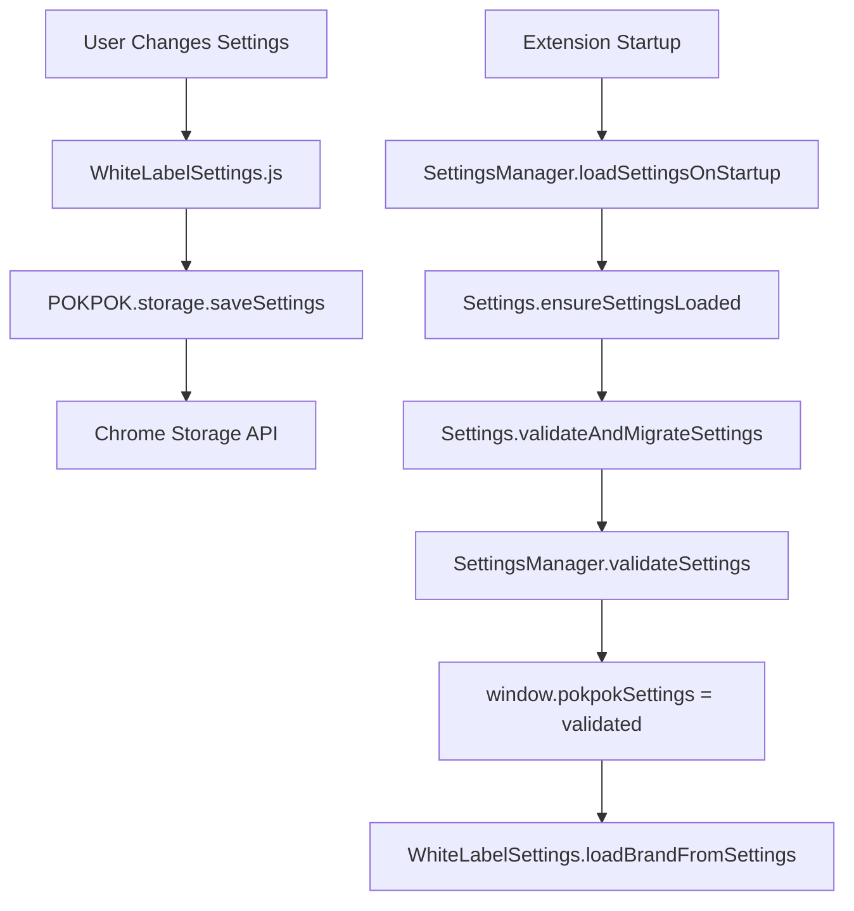

# POKPOK.AI - Tone Analysis Chrome Extension v2.35.0

A Chrome extension for advanced brand voice analysis using Nielsen's 4-dimensional framework and Jung's 12 Brand Archetypes. Features real-time tone analysis with integrated UI sliders, Gemini AI integration, and comprehensive brand insights.

## 🌟 Current Features

### Dual Analysis Engine System
- **🤖 Gemini AI Integration**: Cloud-based comprehensive brand analysis
  - Advanced tone justification with detailed explanations
  - Dynamic brand archetype identification (all 12 Jungian archetypes)
  - Real-time API progress feedback with retry mechanism (2 attempts)
  - JSON output saving for debugging and analysis

- **⚡ Local Analysis Engine**: Fast offline analysis using compromise.js
  - Nielsen's 4-dimensional tone framework
  - Real-time slider updates with visual feedback
  - No API costs, complete privacy

### Nielsen's 4-Dimensional Tone Analysis
- **Formal vs. Casual**: Professional tone assessment (0-100% scale)
- **Serious vs. Funny**: Humor detection and measurement  
- **Respectful vs. Irreverent**: Respect level analysis
- **Matter-of-fact vs. Enthusiastic**: Energy and enthusiasm detection

### Dynamic Brand Archetype System
- **Jung's 12 Archetypes**: Complete archetype identification system
- **🚨 CRITICAL: Position-Based Mapping**: Dynamic primary/secondary/tertiary assignment
- **🔄 Dynamic Expandable Content**: No hardcoded mappings - all content generated at runtime
- **Universal Archetype Support**: Works with any archetype combination from Gemini
- **Click-to-Expand Justifications**: Fresh content loaded on each click

### Advanced UI Features
- **Button Progress Updates**: Real-time feedback during analysis ("✅ System prompt loaded", "🚀 Calling Gemini API...")
- **Dynamic Content Generation**: Justifications created on-demand via user interaction
- **Mode Switching**: Full page vs. selection analysis
- **Visual Feedback**: Animated logo, status indicators, and completion states
- **Console-to-Button Bridge**: Live console output displayed as button labels during analysis

## 🏗️ Technical Architecture (v2.35.0)

### Modern Chrome Extension Stack
- **✅ Manifest V3 Compliant**: Latest Chrome extension standards
- **🤖 Dual AI Engine**: Local (compromise.js) + Cloud (Gemini API)
- **🔧 Pure JavaScript**: No build process - runs vanilla JS + TypeScript-ready
- **📦 Modular Architecture**: 25+ specialized modules for maintainability

### Complete File Structure
```
pure-amazon-extension/
├── manifest.json                  # v2.35.0 - Extension configuration
├── analysis-simple.html           # Main UI with inline CSS
├── analysis.js                    # Legacy compatibility layer & delegation coordinator
├── background.js                  # Chrome extension service worker
├── content-script.js               # Page interaction & content extraction
├── content-styles.css             # Injected page styles
├── lib/compromise.min.js          # Local NLP library (340KB)
├── prompts/                       # Gemini AI system prompts
│   └── comprehensive-brand-analysis.md
└── js/                            # Modular JavaScript architecture:
    ├── 🏛️ NEW MODULAR ARCHITECTURE (v2.33.0+)
    ├── UIController.js            # Button states, mode switching, parsed content
    ├── AnalysisCoordinator.js     # Analysis orchestration and engine coordination
    ├── DataProcessor.js           # Gemini data processing and UI updates
    ├── ContentHandler.js          # Chrome tabs API and content script communication
    ├── SettingsManager.js         # Settings coordination and Chrome storage
    ├── ConsoleToButtonBridge.js   # Live console output as button labels
    ├── event-handlers.js          # DOM event binding system
    ├── 
    ├── 🤖 ANALYSIS ENGINES
    ├── GeminiAnalysisService.js   # Gemini API integration + retry logic
    ├── basic_analysis.js          # Local compromise.js analysis
    ├── 
    ├── ⚙️ SETTINGS SYSTEM
    ├── Settings.js                # Settings management system
    ├── ApiSettings.js             # Gemini API configuration
    ├── AnalysisSettings.js        # Analysis engine settings
    ├── SettingsTabs.js           # Settings UI tabs
    ├── WhiteLabelSettings.js     # Brand customization
    ├── 
    ├── 🎨 UI COMPONENTS
    ├── ToneAnalysisDisplay.js    # Tone sliders & display
    ├── BrandAnalysisCards.js     # Brand archetype cards
    ├── ContentAnalysisSwitch.js  # Analysis mode switching
    ├── Navigation.js             # Tab navigation system
    ├── StatusBar.js              # Connection status
    ├── AnimatedLogo.js           # Logo animation system
    ├── 
    ├── 🔧 UTILITIES
    ├── content-generators.js    # HTML template generators
    ├── RealContentAnalyzer.js   # Real content analysis
    ├── CompromiseDemo.js         # Demo functionality
    ├── chrome-api.js            # Chrome API wrapper
    ├── color-extractor.js       # Visual identity colors
    ├── visual-identity-updater.js # Visual identity updates
    └── ai-toggle.js             # Local/Cloud AI switching
```

#### **Module Loading Order** (analysis-simple.html)
```javascript
1. lib/compromise.min.js                 // NLP engine (compromise.js)
2. js/basic_analysis.js                  // Core tone analysis functions
3. js/content-generators.js             // Static content templates  
4. js/chrome-api.js                      // Chrome extension API wrapper

5. // SETTINGS SYSTEM
6. js/SettingsTabs.js                   // Settings UI tabs
7. js/ApiSettings.js                    // Gemini API configuration
8. js/WhiteLabelSettings.js             // Brand customization
9. js/AnalysisSettings.js               // Analysis engine settings
10. js/Settings.js                       // Configuration management

11. // UI COMPONENTS
12. js/AnimatedLogo.js                   // Logo symbol animation
13. js/StatusBar.js                      // Connection status UI
14. js/Navigation.js                     // Tab navigation
15. js/ContentAnalysisSwitch.js          // Mode switching logic
16. js/ToneAnalysisDisplay.js            // Slider display components
17. js/CompromiseDemo.js                 // Analysis demo controls
18. js/BrandAnalysisCards.js             // Static archetype UI
19. js/GeminiAnalysisService.js          // Gemini API integration

20. // NEW MODULAR ARCHITECTURE (v2.33.0+)
21. js/ConsoleToButtonBridge.js          // Live console output bridge
22. js/UIController.js                   // Button states & UI control
23. js/DataProcessor.js                  // Data processing & UI updates
24. js/ContentHandler.js                 // Chrome content script communication
25. js/SettingsManager.js                // Settings coordination
26. js/AnalysisCoordinator.js            // Analysis flow orchestration
27. js/event-handlers.js                 // DOM event listeners

28. // COLOR ANALYSIS (FULL_PAGE mode)
29. js/color-extractor.js                // Visual identity colors
30. js/visual-identity-updater.js        // Visual identity updates

31. // LEGACY COMPATIBILITY LAYER
32. analysis.js                          // Delegates to new modular architecture
```

## 🚨 CRITICAL FIXES & ARCHITECTURE DECISIONS (v2.34.0 - v2.35.0)

### ⚠️ **MOST CRITICAL LESSON: NO HARDCODED MAPPINGS**

**THE PROBLEM THAT KEPT REPEATING:**
- HTML had hardcoded archetype expandable sections with placeholder data
- JavaScript tried to match by archetype names instead of positions
- This caused displaying wrong content and prevented fresh data loading

**THE SOLUTION - POSITION-BASED MAPPING:**
```javascript
// ❌ WRONG - Name-based matching (NEVER DO THIS)
if (archetypeName === 'The Innocent') {
    data = geminiData.brand_archetypes.primary;  // ← BREAKS when Gemini returns different names
}

// ✅ CORRECT - Position-based mapping (ALWAYS DO THIS)
const position = Array.from(archetypeItems).indexOf(clickedItem);
if (position === 0) {
    data = geminiData.brand_archetypes.primary;    // ← ALWAYS WORKS regardless of names
    commentHeader = 'PRIMARY_ARCHETYPE_ANALYSIS';
}
```

### 🔄 **Dynamic Expandable Content System**

**How It Works Now (v2.35.0):**
1. **HTML has NO hardcoded expandable sections** - only archetype items
2. **First click**: Removes any existing expandable content (ensures fresh data)
3. **Second click**: Creates new expandable content with current analysis data
4. **Position-based headers**: Always shows correct comment headers regardless of data availability

```javascript
// Archetype toggle logic (analysis.js:349)
function toggleArchetype(item) {
    // STEP 1: Set comment header by POSITION (not data-dependent)
    if (position === 0) commentHeader = 'PRIMARY_ARCHETYPE_ANALYSIS';
    if (position === 1) commentHeader = 'SECONDARY_ARCHETYPE_ANALYSIS';  
    if (position === 2) commentHeader = 'TERTIARY_ARCHETYPE_ANALYSIS';
    
    // STEP 2: Try to get real Gemini data
    if (window.geminiAnalysisData && window.geminiAnalysisData.brand_archetypes) {
        archetypeData = window.geminiAnalysisData.brand_archetypes.primary; // position 0
        // ... use real data
    }
    
    // STEP 3: Always provide fallback content
    if (!content) {
        content = "Analysis data not available. Please run a new analysis...";
    }
}
```

### 📋 **Data Flow Architecture**

```mermaid
graph TD
    A[User Clicks Archetype] --> B[toggleArchetype()]
    B --> C{Existing Expandable?}
    C -->|Yes| D[Remove & Exit - Click Again]
    C -->|No| E[Determine Position 0,1,2]
    E --> F[Set Comment Header by Position]
    F --> G{geminiAnalysisData exists?}
    G -->|Yes| H[Use Real Analysis Data]
    G -->|No| I[Use Fallback Message]
    H --> J[Create Expandable Content]
    I --> J
    J --> K[Insert After Clicked Item]
```

## 🔄 Recent Major Updates

### **v2.40.0 - Dynamic Prompt Loading + Gemini API 2025 Compliance** 🚀

**The Enhancement:** Improved Gemini API integration with real-time prompt updates and correct 2025 API structure

**Key Improvements:**
1. **Dynamic Prompt Loading**: System prompt now loads fresh from file on every "ANALYZE FULL PAGE" click
   - ✅ **Real-time updates**: Edit `/prompts/comprehensive-brand-analysis.md` → changes apply immediately  
   - ✅ **No extension reload needed**: Perfect for prompt iteration during development
   - ✅ **Timestamp logging**: Track exactly when prompt was loaded

2. **Gemini API 2025 Structure Compliance**: 
   - ✅ **Fixed API structure**: Proper `systemInstruction` + `contents` with role separation
   - ✅ **Increased timeout**: 30s → 60s for comprehensive analysis results
   - ✅ **Better compatibility**: Follows latest Google AI API specification

**API Structure Change:**
```javascript
// OLD v2.39.0 (Incorrect):
contents: [{ parts: [{ text: systemPrompt }, { text: userMessage }] }]

// NEW v2.40.0 (Correct):
systemInstruction: { parts: [{ text: freshSystemPrompt }] },
contents: [{ role: "user", parts: [{ text: userMessage }] }]
```

**Developer Benefits**: 
- 🔄 **Rapid prompt iteration** without extension reloads
- ⚡ **Better API performance** with correct structure
- 📊 **More comprehensive analysis** with longer timeout
- 🎯 **Cleaner separation** of system vs user messages

### **v2.39.0 - Brand Settings Persistence Fix (Complete)** 🎨

**The Problem:** User brand selection (PokPok ↔ DR) didn't persist across extension reloads

**Investigation Process:**
1. **Initial Analysis**: Suspected Settings.js migration issue → Enhanced migration logging
2. **Deep Dive**: Found settings were saving correctly (14 fields) but loading incorrectly (10 fields)  
3. **Root Cause Discovery**: SettingsManager.validateSettings() was filtering out fields not in defaults
4. **Critical Finding**: `getDefaultSettings()` was missing `whiteLabelBrand` field entirely

**Technical Solution:**
- **🔧 Fixed**: Added `whiteLabelBrand: 'pokpok'` to SettingsManager default settings structure
- **✅ Enhanced**: Settings validation now preserves additional fields not in defaults 
- **📋 Added**: Comprehensive debug logging throughout settings processing pipeline
- **🚀 Result**: All 16 settings fields now preserved (vs. previous 10)

**Code Changes Made:**
```javascript
// SettingsManager.js - getDefaultSettings()
+ whiteLabelBrand: 'pokpok'  // Added missing field

// SettingsManager.js - validateSettings() 
+ Object.keys(settings).forEach(key => {
+     if (!defaults.hasOwnProperty(key)) {
+         validated[key] = settings[key]; // Preserve additional fields
+     }
+ });
```

**Verification:** Brand selection now persists perfectly across extension reloads with full console logging for debugging

### **v2.35.0 - Comment Header Fix** 🏷️
- **🔧 Fixed**: Missing comment headers when no analysis data available
- **✅ Added**: Position-based header assignment regardless of data availability
- **📋 Enhanced**: Always shows `// PRIMARY_ARCHETYPE_ANALYSIS` instead of empty `// `

### **v2.34.0 - Archetype Mapping Complete Fix** ✨
- **🚨 CRITICAL**: Removed ALL hardcoded expandable sections from HTML
- **🔧 Fixed**: toggleArchetype() now always processes fresh data (no early exit)
- **✅ Added**: Comprehensive logging for debugging archetype data flow
- **🔄 Enhanced**: Position-based mapping with fallback content system

### **v2.33.0 - Console-to-Button Bridge & Modular Architecture** 🏗️
- **🚀 Added**: Live console output displayed as animated button labels during analysis
- **📦 Added**: Complete modular architecture (5 core modules ≤300 lines each)
- **🔧 Fixed**: Button state management for SELECTION mode analysis
- **✅ Enhanced**: All console messages intercepted and displayed during analysis process

### **v2.32.0 - Button State Management Fix** ⚡
- **🔧 Fixed**: SELECTION mode button not returning to default state after analysis
- **✅ Added**: endAnalysisMode() calls to restore original console functions
- **🔄 Enhanced**: Proper cleanup in ConsoleToButtonBridge system

## 🧠 **LESSONS LEARNED - FOR FUTURE DEVELOPMENT**

### 1. **NEVER Use Name-Based Matching**
```javascript
// ❌ THIS WILL ALWAYS BREAK
if (item.textContent === 'The Innocent') { /* ... */ }

// ✅ THIS ALWAYS WORKS  
const position = Array.from(items).indexOf(item);
if (position === 0) { /* primary */ }
```

### 2. **NEVER Hardcode Expandable Content in HTML**
```html
<!-- ❌ NEVER DO THIS - Prevents dynamic data loading -->
<div class="archetype-expandable">Hardcoded content...</div>

<!-- ✅ ALWAYS DO THIS - Let JavaScript create content dynamically -->
<div class="archetype-item">Just the archetype item</div>
```

### 3. **ALWAYS Set Headers by Position**
```javascript
// ✅ Set headers BEFORE checking data availability
let commentHeader = position === 0 ? 'PRIMARY_ARCHETYPE_ANALYSIS' : 
                   position === 1 ? 'SECONDARY_ARCHETYPE_ANALYSIS' : 
                   'TERTIARY_ARCHETYPE_ANALYSIS';

// Then try to get data
if (geminiAnalysisData) { /* use real data */ }
else { /* use fallback with proper header */ }
```

### 4. **ALWAYS Use Try/Catch with Button State Reset**
```javascript
try {
    setButtonAnalyzing();
    const result = await analysis();
    setButtonAnalyzed();
} catch (error) {
    resetButtonState(); // ← CRITICAL: Always reset on error
} finally {
    if (window.ConsoleToButtonBridge) {
        window.ConsoleToButtonBridge.endAnalysisMode(); // ← CRITICAL: Always end bridge
    }
}
```

## 🔮 Future Development Guidelines

### **When Adding New Features:**
1. **Check existing modular architecture** - use UIController, DataProcessor, etc.
2. **Never hardcode mappings** - always use position/index-based logic
3. **Test before and after analysis** - ensure proper fallback behavior
4. **Update version numbers** - manifest.json AND HTML status display
5. **Add comprehensive logging** - help future debugging

### **When Fixing Bugs:**
1. **Read the entire function flow** - understand why it was written that way
2. **Look for hardcoded assumptions** - usually the root cause
3. **Test edge cases** - what happens when data is null/undefined?
4. **Follow the data flow** - where is data stored, accessed, modified?

## 📊 Code Metrics (v2.35.0)

| Module | Lines | Purpose | Maintainability |
|--------|-------|---------|----------------|
| UIController.js | <300 | Button states, UI control | ✅ Focused |
| AnalysisCoordinator.js | <300 | Analysis orchestration | ✅ Focused |
| DataProcessor.js | <300 | Data processing & UI updates | ✅ Focused |
| ContentHandler.js | <300 | Chrome API communication | ✅ Focused |
| SettingsManager.js | <300 | Settings coordination | ✅ Focused |
| analysis.js | 575 | Legacy compatibility layer | ✅ Delegation only |
| **Total Architecture** | **~1,800** | **Modular system** | ✅ **Maintainable** |

## 🏗️ Settings Architecture (v2.39.0)

### **Settings Data Flow Pipeline**


### **Critical Settings Fields**
```javascript
// Complete settings structure (16 fields in v2.39.0)
{
    version: "2.28.0",           // Settings schema version
    aiEngine: "local",           // Analysis engine preference  
    model: "gemini-2.5-flash",   // AI model selection
    apiKey: "",                  // Encrypted Gemini API key
    supabaseDb: "",             // Database connection
    autoAnalyze: false,         // Auto-analysis setting
    deepAnalysis: false,        // Deep analysis mode
    saveHistory: false,         // History persistence
    whiteLabelName: "POKPOK.AI", // Display name
    whiteLabelColors: {...},    // Brand color scheme
    whiteLabelBrand: "pokpok",  // ✅ CRITICAL: Brand selection
    lastSettingsTab: "api",     // UI state
    extensionVersion: "2.39.0", // Extension version
    savedAt: "timestamp",       // Save timestamp
    migrated: true,             // Migration status
    previousExtensionVersion: "2.38.0" // Previous version
}
```

### **Settings Validation Logic (v2.39.0)**
```javascript
// SettingsManager.js - validateSettings()
function validateSettings(settings) {
    // 1. Load defaults (11 core fields)
    const defaults = getDefaultSettings();
    const validated = { ...defaults };
    
    // 2. Validate known fields with type checking
    Object.keys(defaults).forEach(key => {
        if (settings.hasOwnProperty(key) && 
            typeof settings[key] === typeof defaults[key]) {
            validated[key] = settings[key];
        }
    });
    
    // 3. ✅ CRITICAL FIX: Preserve additional fields
    Object.keys(settings).forEach(key => {
        if (!defaults.hasOwnProperty(key)) {
            console.log(`🔧 Preserving additional setting: ${key}=${settings[key]}`);
            validated[key] = settings[key]; // Preserves whiteLabelBrand!
        }
    });
    
    return validated; // Returns complete 16-field object
}
```

## 🛡️ Security & Permissions

### **Manifest V3 Compliance**
- `sidePanel`: Analysis interface display
- `activeTab`: Current webpage content access  
- `storage`: Local settings persistence
- `scripting`: Content script injection
- `host_permissions`: All websites (`*://*/*`)

### **Privacy Features**  
- **No external requests**: All processing local (unless Gemini enabled)
- **No data collection**: Zero telemetry
- **Local storage only**: Settings saved in Chrome storage API
- **API keys encrypted**: Gemini keys stored securely in Chrome storage

## 🐛 Bug Fix History

### **Brand Settings Not Persisting - RESOLVED v2.39.0** ✅

**Problem:** Brand selection (PokPok vs DR) in Settings → Branding tab didn't persist after extension reload.

**Symptoms:**
- User selects DR brand in Branding tab
- Clicks "Apply Brand Changes" button  
- Settings appear to save successfully (shows success notification)
- After extension reload: reverted to PokPok default
- Console showed: `🎨 whiteLabelBrand value: undefined`

**Root Cause Investigation:**
1. **Initial hypothesis** (v2.38.0): Settings.js migration not preserving `whiteLabelBrand`
   - ❌ **Incorrect** - Migration was working properly
2. **Actual root cause** (v2.39.0): SettingsManager.js filtering issue
   - **Missing field**: `getDefaultSettings()` didn't include `whiteLabelBrand`
   - **Validation filter**: `validateSettings()` only preserved fields that existed in defaults
   - **Result**: Settings validation was silently removing saved `whiteLabelBrand` field

**Complete Fix Implementation v2.39.0:**
- ✅ **Added** `whiteLabelBrand: 'pokpok'` to SettingsManager default settings structure
- ✅ **Enhanced** validation logic to preserve additional fields not in defaults
- ✅ **Added** comprehensive debug logging throughout settings pipeline
- ✅ **Result** All 16 settings fields now preserved vs. previous 10

**Verification (Console Evidence):**
```javascript
// Before v2.39.0:
🎨 Settings keys: Array(10)
🎨 whiteLabelBrand value: undefined

// After v2.39.0:
🎨 Settings keys: Array(16) 
🎨 whiteLabelBrand value: dr
🎨 Brand loaded from settings: dr
🔧 Final validated settings keys: Array(16)
🔧 Preserving additional setting: whiteLabelBrand
```

**Status:** ✅ **COMPLETELY RESOLVED** - Brand selection now persists perfectly across all extension reloads

---

## 📞 Debugging Support

### **Console Logging Strategy**
```javascript
// Architecture status
console.log('✅ POKPOK.AI Legacy Compatibility Layer Active');
console.log('📦 Modular Architecture Status:');
console.log('  - UIController.js:', typeof window.UIController);

// Analysis flow
console.log('🏛️ Archetype clicked:', archetypeName);
console.log('🔍 Current geminiAnalysisData status:', window.geminiAnalysisData ? 'Available' : 'NULL');
console.log('📍 Clicked item position: ${position} (0=primary, 1=secondary, 2=tertiary)');

// Data processing
console.log('📊 Processing Gemini data for position:', position);
console.log('✅ Using PRIMARY archetype data:', archetypeData?.name);

// Brand settings debugging (v2.39.0+)
console.log('🎨 Settings keys:', Object.keys(settings));
console.log('🎨 whiteLabelBrand value:', settings?.whiteLabelBrand);
console.log('🔧 SettingsManager validation:', validated ? 'Complete' : 'Failed');
console.log('🔧 Final validated settings keys:', Object.keys(validatedSettings));
console.log('🔧 Preserving additional setting:', additionalField);
```

### **Common Console Messages & Meanings**

#### **Settings & Brand Management (v2.39.0+)**
```javascript
// ✅ EXPECTED - Settings validation working correctly
"🔧 SettingsManager.validateSettings called with: Object"
"🔧 Input whiteLabelBrand: dr" 
"🔧 Final validated settings keys: Array(16)"
"🔧 Preserving additional setting: whiteLabelBrand=dr"
"🎨 Brand loaded from settings: dr"
"🎨 Brand applied to UI successfully"

// ❌ ERROR - Settings issues (should not appear in v2.39.0+)
"🎨 whiteLabelBrand value: undefined"
"🎨 Settings keys: Array(10)" // Should be 16
"⚠️ Settings not loaded, returning defaults"
```

#### **Gemini API Integration (v2.40.0+)**
```javascript
// ✅ EXPECTED - Fresh prompt loading and correct API structure
"🎯 Starting Gemini page analysis with fresh prompt..."
"📄 Loading fresh system prompt from file..."
"✅ Fresh system prompt loaded successfully" // With timestamp
"🤖 Making Gemini API call with 2025 structure..."
"📤 Sending API request..." // systemInstruction + contents structure
"📥 API response received" // Within 60s timeout

// ✅ EXPECTED - Real-time prompt iteration
"Fresh system prompt loaded successfully { length: 5847, timestamp: '2025-01-19T...' }"

// ❌ ERROR - API structure issues (should not appear in v2.40.0+)  
"Failed to load system prompt: 404"
"API request failed: 400" // Usually indicates incorrect structure
"Request timeout exceeded" // Should not happen with 60s timeout
```

#### **Analysis System**
```javascript
// ✅ EXPECTED - Normal behavior when no analysis run yet
"⚠️ No geminiAnalysisData available - analysis not run yet"
"⚠️ Using fallback content"

// ✅ EXPECTED - Bridge system working correctly  
"🎬 Starting button animation"
"🤖 Making Gemini API call..."
"🔄 RESETTING BUTTON STATE"

// ❌ ERROR - Something is broken
"❌ Full page analysis failed:" 
"❌ Error starting full page analysis:"
"❌ GeminiAnalysisService not available"
```

#### **Architecture Health Check**
```javascript
// ✅ EXPECTED - Modular architecture status
"📦 Modular Architecture Status:"
"  - UIController.js: object"
"  - SettingsManager.js: object"
"  - WhiteLabelSettings module initialized"

// ✅ EXPECTED - Settings pipeline working
"Settings loaded successfully: Object" 
"API settings populated successfully"
"📢 Settings loaded event dispatched to modules"
```

## 🎯 Development Workflow

### **Safe Development Practices**
1. **Always backup before changes**: `git add . && git commit -m "Backup before changes"`
2. **Read files first**: Use Read tool before editing to understand context
3. **Test incrementally**: Small changes, test in Chrome after each
4. **Version management**: Update manifest.json + HTML version after any functional change
5. **Module approach**: Prefer editing existing files over creating new ones
6. **Follow position-based patterns**: Never use name-based matching

### **Testing Checklist**

#### **Basic Extension Loading**
```bash
# 1. Load extension in Chrome
chrome://extensions/ → Developer mode → Load unpacked

# 2. Verify modular architecture
# Right-click extension → Inspect → Console tab
# Should see: "📦 Modular Architecture Status:" with all modules as 'object'
```

#### **Brand Settings Persistence (v2.39.0+)**
```bash
# 3. Test brand switching and persistence
# - Open Settings (gear icon) → Branding tab
# - Switch from PokPok to DR 
# - Click "Apply Brand Changes" 
# - Should see DR logo and "Dragon Rouge" text

# 4. Test persistence across reload
# - Reload extension (toggle off/on in chrome://extensions)
# - Extension should still show DR branding (not revert to PokPok)
# - Console should show: "🎨 whiteLabelBrand value: dr"
# - Console should show: "🔧 Final validated settings keys: Array(16)"
```

#### **Analysis System Testing**
```bash
# 5. Test archetype clicking BEFORE analysis
# - Click any archetype item
# - Should see: "Analysis data not available. Please run a new analysis..."
# - Should see: "// PRIMARY_ARCHETYPE_ANALYSIS" (not empty "// ")

# 6. Test archetype clicking AFTER analysis  
# - Run ANALYZE FULL PAGE with Gemini API
# - Click archetype items
# - Should see: Real Gemini analysis data with proper headers
```

#### **Gemini API Testing (v2.40.0+)**
```bash
# 7. Test dynamic prompt loading
# - Edit /prompts/comprehensive-brand-analysis.md 
# - Add a test line: "TEST PROMPT UPDATE"
# - Click "ANALYZE FULL PAGE" 
# - Console should show: "Fresh system prompt loaded successfully" with timestamp
# - API should use updated prompt content immediately (no extension reload needed)

# 8. Test Gemini API structure
# - Run analysis with valid API key
# - Console should show: "Making Gemini API call with 2025 structure..."
# - Should NOT see: "API request failed: 400" (indicates wrong structure)
# - Response should arrive within 60 seconds
```

#### **Debug Console Verification**
```bash
# 9. Check console for expected messages
# Should see (in order):
# - "POKPOK.AI Chrome Extension loaded with new modular architecture (v2.40.0)"
# - "🔧 SettingsManager.validateSettings called with: Object"
# - "🔧 Final validated settings keys: Array(16)"
# - "🎨 whiteLabelBrand value: dr" (if DR brand was saved)
# - "🎨 Brand applied to UI successfully"
# - "📄 Loading fresh system prompt from file..." (on analysis)
# - "✅ Fresh system prompt loaded successfully" (with timestamp)

# Should NOT see:
# - "🎨 whiteLabelBrand value: undefined"
# - "🎨 Settings keys: Array(10)" (should be 16)
# - "API request failed: 400" (indicates API structure issues)
# - Any timeout errors with 60s limit
```

---

**POKPOK.AI v2.40.0** - Advanced Brand Voice Analysis  
**Architecture**: Modular Chrome Extension (Manifest V3 Compliant)  
**Analysis Engine**: Dual System - Local compromise.js + Cloud Gemini API  
**UI Framework**: Vanilla JS with shadcn/ui styling  
**Key Features**: Dynamic justifications, Position-based mapping, Console-to-button bridge  
**Critical Fix**: NO hardcoded mappings - ALL content generated dynamically  
**Last Updated**: August 2024